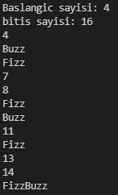

# FizzBuzz

### 2 sayı arasındaki fiz  ve buzzları bulma 

#### Burada klavye ile girdiğimiz başlangıç ve bitiş sayılarına arasında kalan sayıları öncelikle olarak belirliyoruz.
#### Daha sonra sayıların 3 katı ise Fizz, 5 katını Buzz, hem 3 ve hem 5 katı ise ekrana FizzBuzz yazdıran kod.

#### 
